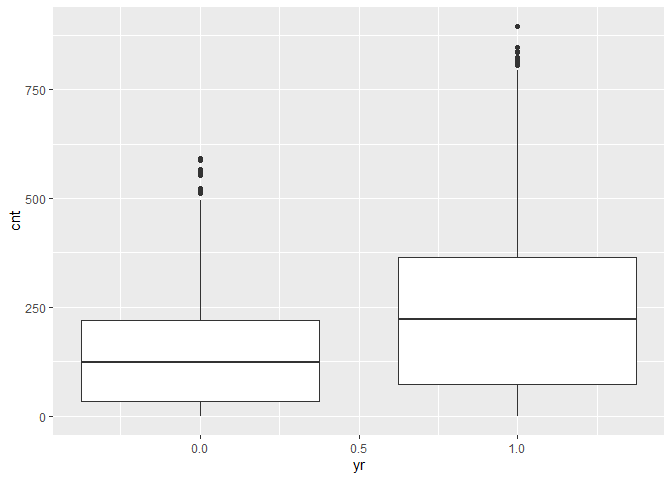
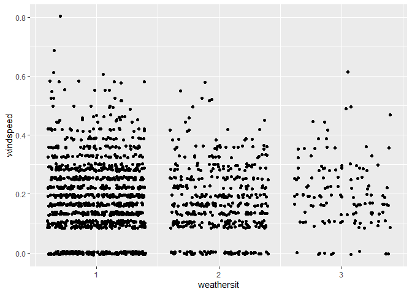

  - [Introduction](#introduction)
  - [Setting the Value for the
    Parameter](#setting-the-value-for-the-parameter)
  - [Data](#data)
  - [Splitting Data](#splitting-data)
  - [Summaries and Exploratory Data
    Analysis](#summaries-and-exploratory-data-analysis)
  - [Fitting models](#fitting-models)
      - [Regression tree](#regression-tree)
      - [Boosted Tree](#boosted-tree)
      - [Comparison](#comparison)

## Introduction

Now we take a look at Friday’s analysis. This dataset contains
information about bike sharing. We have a variety of predictors,
including hours, temperature, humidity, weekday, holiday/workday or not,
etc. We will use the variable `cnt` as the response variable.

## Setting the Value for the Parameter

Since the current analysis is on Friday, we first find the corresponding
value for it.

``` r
set.seed(7777)
i <- 0:6
dayz <- c("Sunday", "Monday", "Tuesday", "Wednesday", "Thursday", "Friday", "Saturday")
df <- as.data.frame(cbind(i, dayz))
weekdayNum <- df$i[df$dayz == params$weekday]
print(weekdayNum)
```

    ## [1] "5"

## Data

Now we read in the data. Two datasets are listed on [the
link](https://archive.ics.uci.edu/ml/datasets/Bike+Sharing+Dataset), one
including the `hr` variable, and one treating each day as one
observation and thus not including the `hr` variable. Since hours–the
time in the day–should be a meaningful predictor for the number of bike
rentals, we use the dataset with the `hr` variable

``` r
bikes <- read_csv("../Bike-Sharing-Dataset/hour.csv")
```

    ## Parsed with column specification:
    ## cols(
    ##   instant = col_double(),
    ##   dteday = col_date(format = ""),
    ##   season = col_double(),
    ##   yr = col_double(),
    ##   mnth = col_double(),
    ##   hr = col_double(),
    ##   holiday = col_double(),
    ##   weekday = col_double(),
    ##   workingday = col_double(),
    ##   weathersit = col_double(),
    ##   temp = col_double(),
    ##   atemp = col_double(),
    ##   hum = col_double(),
    ##   windspeed = col_double(),
    ##   casual = col_double(),
    ##   registered = col_double(),
    ##   cnt = col_double()
    ## )

``` r
head(bikes)
analysis <- bikes %>% filter(weekday == weekdayNum) %>% select(-casual, -registered) %>% select(dteday, weekday, everything()) 
head(analysis)
```

## Splitting Data

We first split up the data into two sets: training and test sets. The
training set has about 70% of the data, and the test set has about 30%.
Splitting up the data is important, because we want to test the model on
a set that is not used in training. Otherwise, we risk overfitting.

``` r
train <- sample(1:nrow(analysis), size = nrow(analysis)*0.7)
test <- setdiff(1:nrow(analysis), train)

bikeTrain <- analysis[train,]
bikeTest <- analysis[test,]
```

## Summaries and Exploratory Data Analysis

To decide which variables to include in our models, we first take a
quick look at the data. We can look at summaries of numerical variables.

``` r
summary(bikeTrain)
```

    ##      dteday              weekday     instant          season            yr        
    ##  Min.   :2011-01-07   Min.   :5   Min.   :  139   Min.   :1.000   Min.   :0.0000  
    ##  1st Qu.:2011-07-01   1st Qu.:5   1st Qu.: 4270   1st Qu.:2.000   1st Qu.:0.0000  
    ##  Median :2011-12-30   Median :5   Median : 8604   Median :2.500   Median :0.0000  
    ##  Mean   :2011-12-30   Mean   :5   Mean   : 8631   Mean   :2.491   Mean   :0.4948  
    ##  3rd Qu.:2012-06-29   3rd Qu.:5   3rd Qu.:12969   3rd Qu.:3.000   3rd Qu.:1.0000  
    ##  Max.   :2012-12-28   Max.   :5   Max.   :17307   Max.   :4.000   Max.   :1.0000  
    ##       mnth              hr           holiday          workingday       weathersit   
    ##  Min.   : 1.000   Min.   : 0.00   Min.   :0.00000   Min.   :0.0000   Min.   :1.000  
    ##  1st Qu.: 4.000   1st Qu.: 6.00   1st Qu.:0.00000   1st Qu.:1.0000   1st Qu.:1.000  
    ##  Median : 7.000   Median :12.00   Median :0.00000   Median :1.0000   Median :1.000  
    ##  Mean   : 6.547   Mean   :11.58   Mean   :0.01839   Mean   :0.9816   Mean   :1.409  
    ##  3rd Qu.: 9.000   3rd Qu.:18.00   3rd Qu.:0.00000   3rd Qu.:1.0000   3rd Qu.:2.000  
    ##  Max.   :12.000   Max.   :23.00   Max.   :1.00000   Max.   :1.0000   Max.   :3.000  
    ##       temp            atemp             hum           windspeed           cnt       
    ##  Min.   :0.0600   Min.   :0.0303   Min.   :0.0800   Min.   :0.0000   Min.   :  1.0  
    ##  1st Qu.:0.3400   1st Qu.:0.3182   1st Qu.:0.4700   1st Qu.:0.1045   1st Qu.: 47.0  
    ##  Median :0.5000   Median :0.4848   Median :0.6100   Median :0.1642   Median :164.0  
    ##  Mean   :0.4981   Mean   :0.4730   Mean   :0.6154   Mean   :0.1871   Mean   :195.2  
    ##  3rd Qu.:0.6600   3rd Qu.:0.6212   3rd Qu.:0.7700   3rd Qu.:0.2537   3rd Qu.:287.0  
    ##  Max.   :0.9800   Max.   :0.9848   Max.   :1.0000   Max.   :0.8060   Max.   :894.0

Below we look at three plots. The first plot shows the histogram of bike
rentals (`cnt`) on Friday. The second plot shows that `cnt` does vary in
different hours. The third plot shows that `cnt` varies between the two
years. So we know we should keep `hr` and `yr` as predictors.

``` r
ggplot(bikeTrain, mapping = aes(x = cnt)) + geom_histogram()
```

    ## `stat_bin()` using `bins = 30`. Pick better value with `binwidth`.

<!-- -->

``` r
ggplot(bikeTrain, aes(x = hr, y = cnt)) + geom_point() + geom_jitter()
```

<!-- -->

``` r
ggplot(bikeTrain, aes(x = yr, y = cnt)) + geom_boxplot(aes(group = yr))
```

<!-- -->

Next we look at correlations of different variables. Weather and
windspeed do not seem correlate, so we will keep both `weathersit` and
`windspeed`.

``` r
ggplot(bikeTrain, aes(x = weathersit, y = windspeed)) + geom_jitter()
```

<!-- -->

Several pairs of variables seem highly correlated–`season` and `mnth`,
`holiday` and `workingday`–so we’ll remove one from each pair.

``` r
cor(bikeTrain$season, bikeTrain$mnth)
```

    ## [1] 0.80216

``` r
cor(bikeTrain$holiday, bikeTrain$workingday)
```

    ## [1] -1

``` r
cor(bikeTrain$temp, bikeTrain$atemp)
```

    ## [1] 0.9636363

The variance of `workingday` and `holiday` is 0 or too small.

``` r
var(bikeTrain$holiday)
```

    ## [1] 0.01806296

``` r
var(bikeTrain$workingday)
```

    ## [1] 0.01806296

Also, `instant` and `dteday` are for record-keeping. Thus, we decide to
keep these as the predictors: `season`, `yr`, `hr`, `weathersit`,
`atemp`, `hum`, and `windspeed`.

``` r
bikeTrain <- select(bikeTrain, season, yr, hr, weathersit, atemp, hum, windspeed, cnt)
bikeTest <- select(bikeTest, season, yr, hr, weathersit, atemp, hum, windspeed, cnt)
```

## Fitting models

Now we have a training set and chose the predictors, we can use two
models–regression tree and boosted tree–to fit the training data.

### Regression tree

For regression tree, we use the `caret` package and apply the
leave-one-out cross validation method (thus the argument `method =
"LOOCV"`). We set the `tuneLength` as 10 and let the model chooses the
best model automatically. Then we use the model to predict `cnt` on the
test data. Finally, we calculate RMSE to see the fit of the model and
for comparison.

``` r
modelLookup("rpart")

bikeTree <- train(cnt ~ ., data = bikeTrain, method = "rpart", trControl = trainControl(method = "LOOCV"), tuneLength = 10)

predTree <- predict(bikeTree, newdata = bikeTest)
treeRMSE <- sqrt(mean((predTree - bikeTest$cnt)^2))
postResample(predTree, bikeTest$cnt)
```

    ##       RMSE   Rsquared        MAE 
    ## 84.9477745  0.7681535 59.9080146

### Boosted Tree

Now we use one of the ensemble method, boosted tree. We again use
`caret` package and set the method as `gbm`. We use repeated cross
validation (`repeatedcv`) and again set the `tuneLength` as 10 and let
the model chooses the best model automatically. Then we use the model to
predict `cnt` on the test data. Finally, we calculate RMSE to see the
fit of the model and for comparison.

``` r
modelLookup("gbm")

boostedBike <- train(cnt ~  season + yr + hr + weathersit + atemp + hum + windspeed, data = bikeTrain, method = "gbm", preProcess = c("center", "scale"), trControl = trainControl(method = "repeatedcv", number = 10, repeats = 3), tuneLength = 10, verbose = FALSE)
predBoostedBike <- predict(boostedBike, newdata = select(bikeTest, -cnt))
boostedRMSE <- sqrt(mean((predBoostedBike - bikeTest$cnt)^2))
postResample(predBoostedBike, bikeTest$cnt)
```

    ##       RMSE   Rsquared        MAE 
    ## 45.9036708  0.9322301 28.4553741

### Comparison

We can put the RMSE from the two models together for comparison.

``` r
comparison <- data.frame(treeRMSE, boostedRMSE)
colnames(comparison) <- c("Regression Tree", "Boosted Tree")
rownames(comparison) <- c("RMSE")
knitr::kable(comparison, caption = "Comparison between Regression Tree and Boosted Tree")
```

|      | Regression Tree | Boosted Tree |
| :--- | --------------: | -----------: |
| RMSE |        84.94777 |     45.90367 |

Comparison between Regression Tree and Boosted Tree

``` r
# a function to generate the name of the best model
model <- function(x, y){
  if (x > y) {
    final <- c("boosted tree")
  }
  else {
    final <- c("regression tree")
  }
  return(final)
}
```

From the output, we can conclude that boosted tree is the better model.
