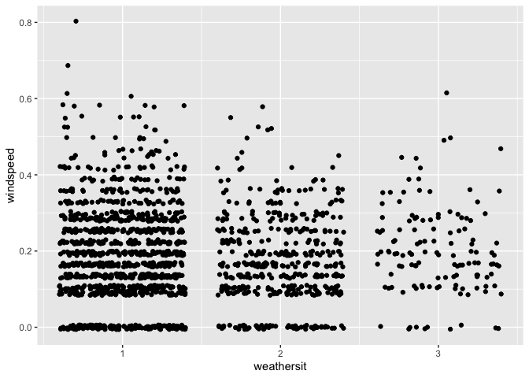
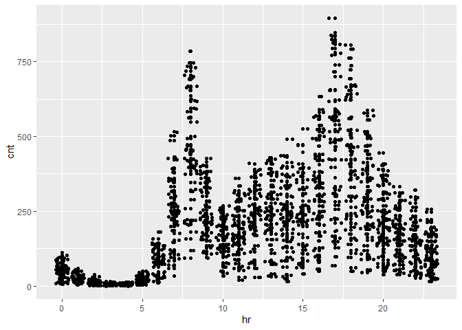
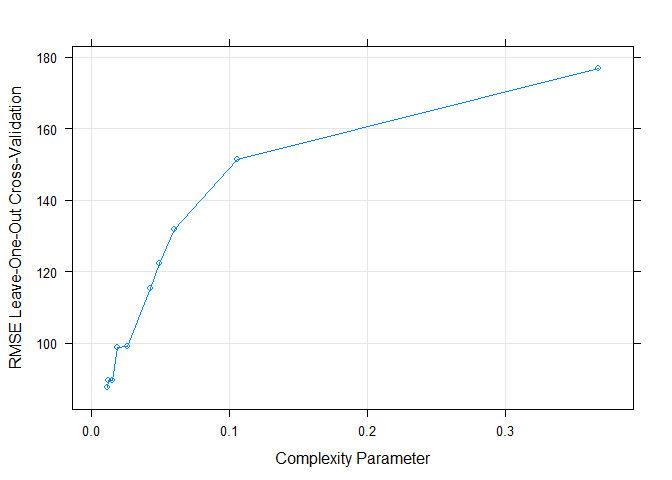
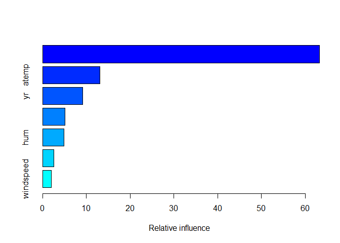
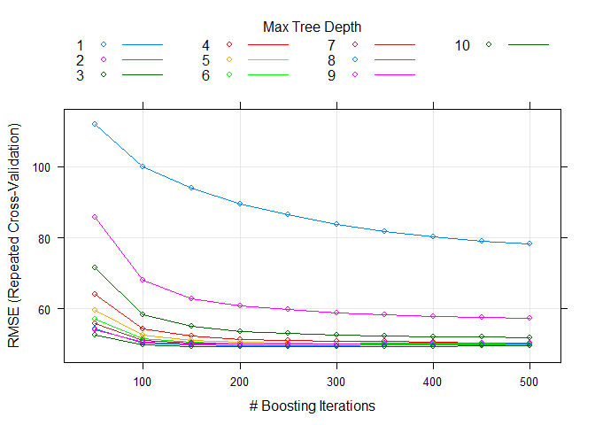

Friday
================
Shih-Ni Prim
2020-10-14

  - [Introduction](#introduction)
  - [Setting the Value for the
    Parameter](#setting-the-value-for-the-parameter)
  - [Data](#data)
  - [Splitting Data](#splitting-data)
  - [Summaries and Exploratory Data
    Analysis](#summaries-and-exploratory-data-analysis)
  - [Fitting models](#fitting-models)
      - [Regression tree](#regression-tree)
      - [Boosted Tree](#boosted-tree)
      - [Comparison](#comparison)
      - [Final Model](#final-model)

## Introduction

Now we take a look at Friday’s analysis. This dataset contains
information about [bike
sharing](https://archive.ics.uci.edu/ml/datasets/Bike+Sharing+Dataset).
We have a variety of predictors, including hours, temperature, humidity,
weekday, holiday/workday or not, etc. In our analysis, We will use two
statistical learning models–regression tree and boosted tree–to predict
the count of total rental bikes `cnt`.

## Setting the Value for the Parameter

Since the current analysis is on Friday, we first find the corresponding
value for it.

``` r
set.seed(7777)
i <- 0:6
dayz <- c("Sunday", "Monday", "Tuesday", "Wednesday", "Thursday", "Friday", "Saturday")
df <- as.data.frame(cbind(i, dayz))
weekdayNum <- df$i[df$dayz == params$weekday]
print(weekdayNum)
```

    ## [1] "5"

## Data

Now we read in the data. Two datasets are listed on [the
link](https://archive.ics.uci.edu/ml/datasets/Bike+Sharing+Dataset), one
including the `hr` variable, and one treating each day as one
observation and thus not including the `hr` variable. Since hours–the
time in the day–should be a meaningful predictor for the number of bike
rentals, we use the dataset with the `hr` variable

``` r
bikes <- read_csv("../Bike-Sharing-Dataset/hour.csv")
```

    ## Parsed with column specification:
    ## cols(
    ##   instant = col_double(),
    ##   dteday = col_date(format = ""),
    ##   season = col_double(),
    ##   yr = col_double(),
    ##   mnth = col_double(),
    ##   hr = col_double(),
    ##   holiday = col_double(),
    ##   weekday = col_double(),
    ##   workingday = col_double(),
    ##   weathersit = col_double(),
    ##   temp = col_double(),
    ##   atemp = col_double(),
    ##   hum = col_double(),
    ##   windspeed = col_double(),
    ##   casual = col_double(),
    ##   registered = col_double(),
    ##   cnt = col_double()
    ## )

``` r
# head(bikes)
analysis <- bikes %>% filter(weekday == weekdayNum) %>% select(-casual, -registered) %>% select(dteday, weekday, everything()) 
# head(analysis)
```

## Splitting Data

We first split up the data into two sets: training and test sets. The
training set has about 70% of the data, and the test set has about 30%.
Splitting up the data is important, because we want to test the model on
a set that is not used in training, otherwise we risk overfitting.

``` r
train <- sample(1:nrow(analysis), size = nrow(analysis)*0.7)
test <- setdiff(1:nrow(analysis), train)

bikeTrain <- analysis[train,]
bikeTest <- analysis[test,]
```

## Summaries and Exploratory Data Analysis

To decide which variables to include in our models, we first take a
quick look at the data. We can look at summaries of numerical variables.

``` r
summary(bikeTrain)
```

    ##      dteday              weekday     instant          season            yr        
    ##  Min.   :2011-01-07   Min.   :5   Min.   :  139   Min.   :1.000   Min.   :0.0000  
    ##  1st Qu.:2011-07-01   1st Qu.:5   1st Qu.: 4270   1st Qu.:2.000   1st Qu.:0.0000  
    ##  Median :2011-12-30   Median :5   Median : 8604   Median :2.500   Median :0.0000  
    ##  Mean   :2011-12-30   Mean   :5   Mean   : 8631   Mean   :2.491   Mean   :0.4948  
    ##  3rd Qu.:2012-06-29   3rd Qu.:5   3rd Qu.:12969   3rd Qu.:3.000   3rd Qu.:1.0000  
    ##  Max.   :2012-12-28   Max.   :5   Max.   :17307   Max.   :4.000   Max.   :1.0000  
    ##       mnth              hr           holiday          workingday       weathersit   
    ##  Min.   : 1.000   Min.   : 0.00   Min.   :0.00000   Min.   :0.0000   Min.   :1.000  
    ##  1st Qu.: 4.000   1st Qu.: 6.00   1st Qu.:0.00000   1st Qu.:1.0000   1st Qu.:1.000  
    ##  Median : 7.000   Median :12.00   Median :0.00000   Median :1.0000   Median :1.000  
    ##  Mean   : 6.547   Mean   :11.58   Mean   :0.01839   Mean   :0.9816   Mean   :1.409  
    ##  3rd Qu.: 9.000   3rd Qu.:18.00   3rd Qu.:0.00000   3rd Qu.:1.0000   3rd Qu.:2.000  
    ##  Max.   :12.000   Max.   :23.00   Max.   :1.00000   Max.   :1.0000   Max.   :3.000  
    ##       temp            atemp             hum           windspeed           cnt       
    ##  Min.   :0.0600   Min.   :0.0303   Min.   :0.0800   Min.   :0.0000   Min.   :  1.0  
    ##  1st Qu.:0.3400   1st Qu.:0.3182   1st Qu.:0.4700   1st Qu.:0.1045   1st Qu.: 47.0  
    ##  Median :0.5000   Median :0.4848   Median :0.6100   Median :0.1642   Median :164.0  
    ##  Mean   :0.4981   Mean   :0.4730   Mean   :0.6154   Mean   :0.1871   Mean   :195.2  
    ##  3rd Qu.:0.6600   3rd Qu.:0.6212   3rd Qu.:0.7700   3rd Qu.:0.2537   3rd Qu.:287.0  
    ##  Max.   :0.9800   Max.   :0.9848   Max.   :1.0000   Max.   :0.8060   Max.   :894.0

Below we look at three plots. The first plot shows the histogram of bike
rentals (`cnt`) on Friday. The second plot shows that `cnt` does vary in
different hours. The third plot shows that `cnt` varies between the two
years. So we know we should keep `hr` and `yr` as predictors.

``` r
ggplot(bikeTrain, mapping = aes(x = cnt)) + geom_histogram()
```

    ## `stat_bin()` using `bins = 30`. Pick better value with `binwidth`.

<!-- -->

``` r
ggplot(bikeTrain, aes(x = hr, y = cnt)) + geom_point() + geom_jitter()
```

<!-- -->

``` r
ggplot(bikeTrain, aes(x = yr, y = cnt)) + geom_boxplot(aes(group = yr))
```

<!-- -->

Next we look at correlations of different variables. Weather and
windspeed do not seem correlate, so we will keep both `weathersit` and
`windspeed`.

``` r
ggplot(bikeTrain, aes(x = weathersit, y = windspeed)) + geom_jitter()
```

<!-- -->

Several pairs of variables seem highly correlated–`season` and `mnth`,
`holiday` and `workingday`–so we’ll remove one from each pair.

``` r
cor(bikeTrain$season, bikeTrain$mnth)
```

    ## [1] 0.80216

``` r
cor(bikeTrain$holiday, bikeTrain$workingday)
```

    ## [1] -1

``` r
cor(bikeTrain$temp, bikeTrain$atemp)
```

    ## [1] 0.9636363

The variance of `workingday` and `holiday` are too small and probably
not good predictors.

``` r
var(bikeTrain$holiday)
```

    ## [1] 0.01806296

``` r
var(bikeTrain$workingday)
```

    ## [1] 0.01806296

Also, `instant` and `dteday` are for record-keeping. Thus, we decide to
keep the following variables as the predictors: `season`, `yr`, `hr`,
`weathersit`, `atemp`, `hum`, and `windspeed`.

``` r
bikeTrain <- select(bikeTrain, season, yr, hr, weathersit, atemp, hum, windspeed, cnt)
bikeTest <- select(bikeTest, season, yr, hr, weathersit, atemp, hum, windspeed, cnt)
```

## Fitting models

Now we have a final training set and have chosen the predictors, we can
use two models–regression tree and boosted tree–to fit the training
data.

### Regression tree

A regression tree is one of the tree based methods for supervised
learning with the goal of predicting a continuous response. It splits up
predictor space into different regions, and the prediction of each
region is often the mean of observations in that region.

For regression tree, we use the `caret` package and apply the
leave-one-out cross validation method (thus the argument `method =
"LOOCV"`). We set the `tuneLength` as 10 and let the model chooses the
best model automatically.

``` r
modelLookup("rpart")

bikeTree <- train(cnt ~ ., data = bikeTrain, method = "rpart", trControl = trainControl(method = "LOOCV"), tuneLength = 10)
```

Below we can see the final model; the resulting RMSE, Rsquared, and MAE
of different cp; and a plot that shows the relationship between cp and
RMSE.

``` r
bikeTree$finalModel
```

    ## n= 1740 
    ## 
    ## node), split, n, deviance, yval
    ##       * denotes terminal node
    ## 
    ##   1) root 1740 52102700.0 195.22180  
    ##     2) hr< 6.5 504   576865.3  30.88492 *
    ##     3) hr>=6.5 1236 32364240.0 262.23300  
    ##       6) yr< 0.5 625  8695546.0 196.23360  
    ##        12) atemp< 0.4015 237  1337920.0 120.10550 *
    ##        13) atemp>=0.4015 388  5145108.0 242.73450  
    ##          26) hr>=19.5 85   233632.0 169.69410 *
    ##          27) hr< 19.5 303  4330799.0 263.22440  
    ##            54) hr< 15.5 209  1688020.0 218.65070 *
    ##            55) hr>=15.5 94  1304279.0 362.32980 *
    ##       7) yr>=0.5 611 18161420.0 329.74470  
    ##        14) hr>=19.5 144  1223835.0 200.86110 *
    ##        15) hr< 19.5 467 13808030.0 369.48610  
    ##          30) season< 1.5 118  1496402.0 246.05080 *
    ##          31) season>=1.5 349  9905872.0 411.22060  
    ##            62) hr< 15.5 238  4066170.0 351.26470  
    ##             124) hr>=8.5 187  1062148.0 311.68450 *
    ##             125) hr< 8.5 51  1636908.0 496.39220  
    ##               250) hr< 7.5 25   149007.8 368.64000 *
    ##               251) hr>=7.5 26   687562.6 619.23080 *
    ##            63) hr>=15.5 111  3149755.0 539.77480  
    ##             126) hr>=18.5 31   425393.7 419.45160 *
    ##             127) hr< 18.5 80  2101641.0 586.40000 *

``` r
bikeTree
```

    ## CART 
    ## 
    ## 1740 samples
    ##    7 predictor
    ## 
    ## No pre-processing
    ## Resampling: Leave-One-Out Cross-Validation 
    ## Summary of sample sizes: 1739, 1739, 1739, 1739, 1739, 1739, ... 
    ## Resampling results across tuning parameters:
    ## 
    ##   cp          RMSE       Rsquared     MAE      
    ##   0.01123520   87.70083  0.743247050   62.56272
    ##   0.01195179   89.43473  0.733031793   62.89577
    ##   0.01536077   89.56793  0.732529799   63.05005
    ##   0.01841725   98.78902  0.674964623   71.01588
    ##   0.02623883   99.06100  0.672898655   71.17561
    ##   0.04246455  115.26770  0.562203285   83.84722
    ##   0.04890057  122.36905  0.501927417   86.27382
    ##   0.06006503  131.73617  0.426152289   93.97863
    ##   0.10570052  151.21147  0.259042761  113.00067
    ##   0.36776580  176.67157  0.005437973  154.50486
    ## 
    ## RMSE was used to select the optimal model using the smallest value.
    ## The final value used for the model was cp = 0.0112352.

``` r
plot(bikeTree)
```

<!-- -->

Finally we use the model to predict `cnt` on the test data and calculate
RMSE to check the fit of the model.

``` r
predTree <- predict(bikeTree, newdata = bikeTest)
treeResult <- postResample(predTree, bikeTest$cnt)
```

### Boosted Tree

A boosted tree is one of the ensemble learning methods, in which the
tree grows sequentially. Each subsequent tree is combined into the
previous model to produce a modified model. The predictions are updated
as the tree grows.

We again use `caret` package and set the method as `gbm`. We use
repeated cross validation (`repeatedcv`) and set the `tuneLength` as 10
and let the model chooses the best model automatically.

``` r
modelLookup("gbm")

boostedBike <- train(cnt ~  season + yr + hr + weathersit + atemp + hum + windspeed, data = bikeTrain, method = "gbm", preProcess = c("center", "scale"), trControl = trainControl(method = "repeatedcv", number = 10, repeats = 3), tuneLength = 10, verbose = FALSE)
```

Below we can see some information about the final model, the predictors
chosen and their importance, and a plot that shows how RMSE changes with
different numbers of boosting iterations and tree depths.

``` r
boostedBike$finalModel
```

    ## A gradient boosted model with gaussian loss function.
    ## 350 iterations were performed.
    ## There were 7 predictors of which 7 had non-zero influence.

``` r
summary(boostedBike)
```

<!-- -->

``` r
plot(boostedBike)
```

<!-- -->

Finally, we use the model to predict `cnt` on the test data and
calculate RMSE to check the fit of the model.

``` r
predBoostedBike <- predict(boostedBike, newdata = select(bikeTest, -cnt))
boostedResult <- postResample(predBoostedBike, bikeTest$cnt)
```

### Comparison

We can put the testing RMSE from the two models together for comparison.

``` r
comparison <- data.frame(rbind(t(treeResult), t(boostedResult)))
colnames(comparison) <- c("RMSE", "Rsquared", "MAE")
rownames(comparison) <- c("Regression Tree", "Boosted Tree")
knitr::kable(comparison)
```

|                 |     RMSE |  Rsquared |      MAE |
| :-------------- | -------: | --------: | -------: |
| Regression Tree | 84.94777 | 0.7681535 | 59.90801 |
| Boosted Tree    | 45.90367 | 0.9322301 | 28.45537 |

### Final Model

``` r
# a function to generate the name of the best model
model <- function(x, y){
  xscore <- 0
  if (x[[1]] < y[[1]]) {
    xscore = xscore + 1
  }
  if (x[[2]] > y[[2]]){
    xscore = xscore + 1
  }
  if (x[[3]] < y[[3]]){
    xscore = xscore + 1
  }
  if (xscore == 2 || xscore == 3){
    final <- c("regression tree")
  } else {
    final <- c("boosted tree")
  }
  return(final)
}
# model(treeResult, boostedResult)
```

From the output, we can conclude that the boosted tree is the better
model for Friday data, because it has better performance in terms of
RMSE, Rsquared, and MAE.
